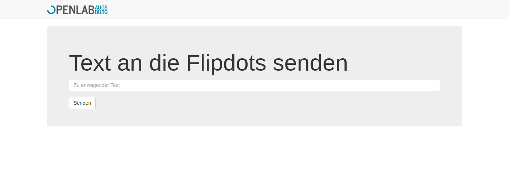

# Flipdotgschichtler

It gschichtles Flipdots over da interwebz.



## Configuring / Deployment
### Web Interface

* Init db `sqlite3 queue.db < schema.sql`
* Change token
* Set `DEBUG = False`
* Deploy flask app in production™
* ???
* PROFIT

### Client

* Set correct hostname and port `scrolltext.py`
* Set correct token and baseurl in `flipper.py`
* Start `flipper.py`
* ???
* PROFIT

## API Documentation

Texts and can be added and deleted via a REST-ish API:

`/queue`: List of the texts in the current queue. Yields a JSON response if 200.

Status codes:
* 200: You're fine
* 500: Something bad happened

Method: `GET`

```json
{
  "length": 2,
  "queue": [
    {
      "id": 30,
      "text": "Echt jetzt?"
    },
    {
      "id": 31,
      "text": "Hallo Welt"
    }
  ]
}
```

`/queue/add`: Add a text to the queue. Warning this yields a HTML response because is the same endpoint as the website uses.

Status codes:

* 200: You're fine
* 400: Your text is malformed (e.g. empty)
* 500: Something bad happened

Method: `POST`

Params: `text`

`/queue/del/<id>`:

Status codes: Delete text with `<id>`. Yields no response if 204.

* 204: Deleted
* 401: Token is wrong
* 404: wrong ID
* 500: Something bad happened

Method: `DELETE`

Params: `token` (must be same as `TOKEN` in `app.py`)
